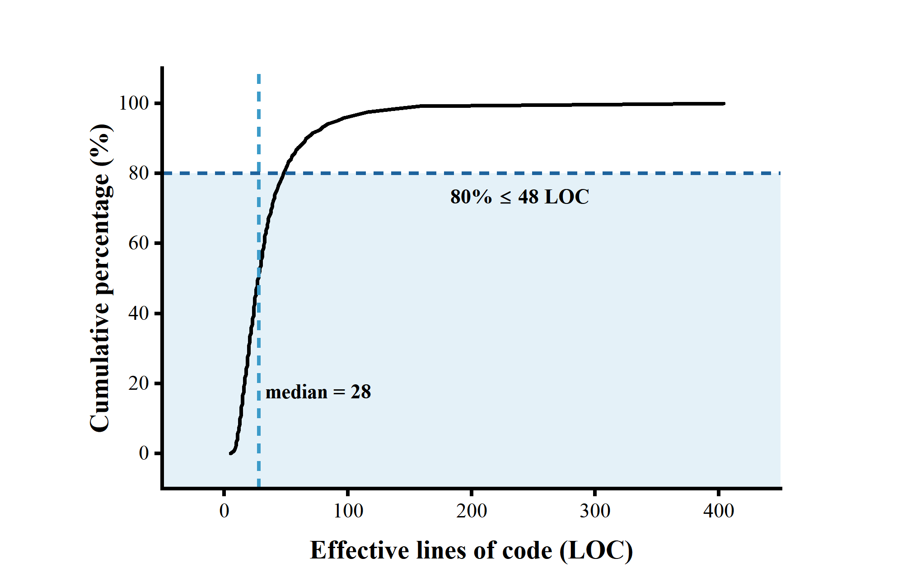
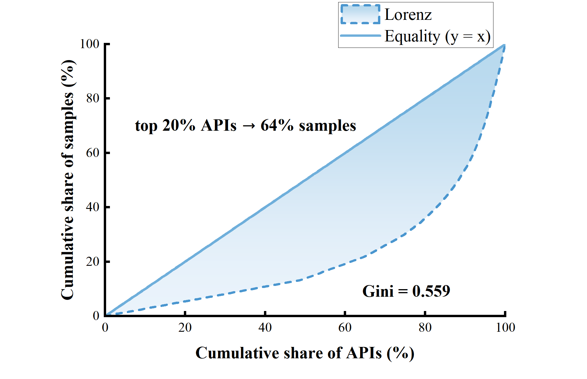
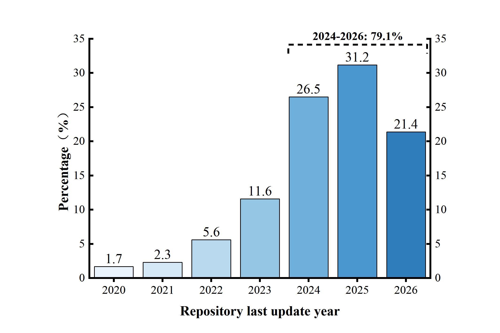
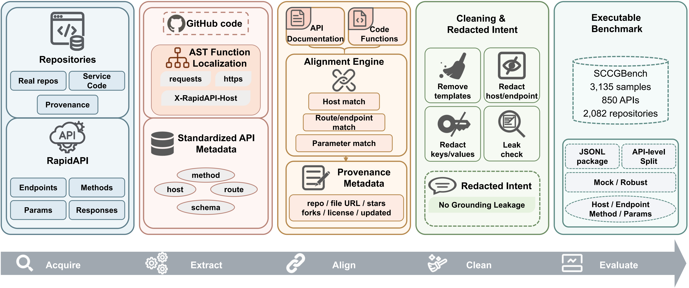
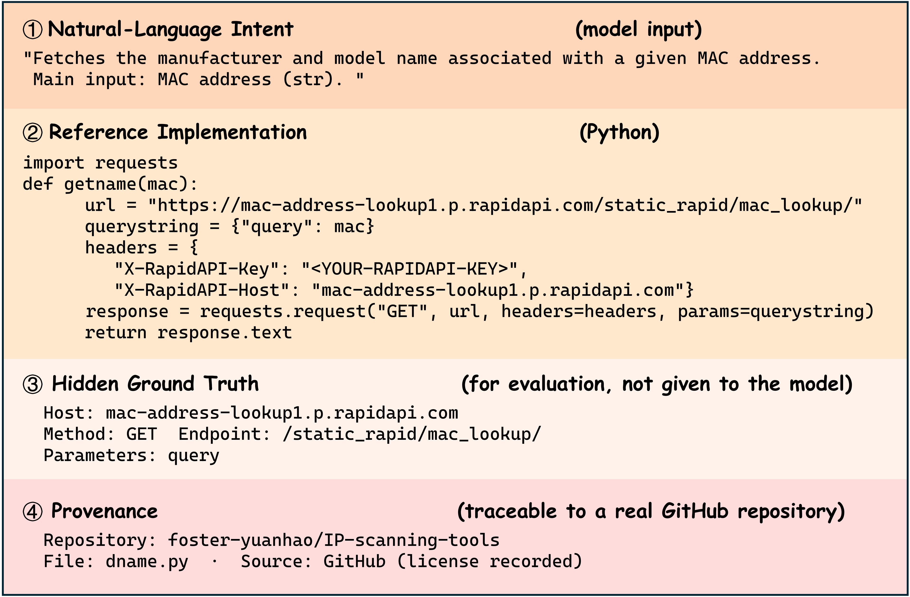

# SCCGBench

[English](README.md) | [中文版](README_zh.md)

SCCGBench is a dataset for **real-world service-call code generation**. Starting from RapidAPI endpoint documentation, it crawls API-call functions written by real developers from GitHub, then builds the final benchmark through multi-level retrieval, quality scoring, documentation alignment, template decontamination, and redacted-intent generation.

Scale: **3,135 samples · 850 APIs · 2,082 GitHub repositories**.

---

## Introduction

Many existing API code-generation datasets rely on **template-generated code** or **tutorial-style examples**, which differ from real development scenarios. **SCCGBench** (**S**ervice-**C**all **C**ode **G**eneration **Bench**mark) aims to collect functions that are **real, traceable to API documentation, and contain complete request-construction and response-handling logic**:

- Functions are mined from real GitHub repositories rather than automatically generated templates.
- Each function is aligned with a corresponding RapidAPI endpoint, including endpoint URL, host, and parameter documentation.
- The dataset covers the complete service-call workflow: credential loading → request construction → invocation → status checking → response parsing → error handling.
- Template/tool-generated wrapper code is removed, and samples without valid comments are supplemented with **redacted intents** as natural-language requirements.

> **Data security:** Credential-like literals in the released code samples are replaced with typed
> `<REDACTED_*>` placeholders. The pre-release audit covers API keys, JWTs, Basic/Bearer credentials,
> cookies, passwords, access tokens, email addresses, and local user paths. Run
> `python3 03_dataset_construction/audit_public_release.py` before every public release.

---

## Dataset Overview

| Metric | Value |
|---|---:|
| Function samples | **3,135** |
| Unique APIs | **850** |
| Unique GitHub repositories | **2,082** |
| Split (train / validation / test) | 2,257 / 266 / 612 |
| Real human comments / redacted-intent comments | 1,726 / 1,409 |
| Average quality score (0–100)\* | 89.82 |
| Quality score ≥ 90 / ≥ 80 / ≥ 70\* | 1,675 / 2,618 / 2,708 |
| Comment coverage / docstring coverage | 65.90% / 25.01% |
| HTTP methods (GET / POST) | 2,537 / 598 |

**Documentation alignment types:** exact URL match: 1,935 · route match: 462 · host-only weak alignment: 738.  
Exact interface alignment (`url + route`) covers **2,397 / 3,135 samples (76.5%)**.

### RapidAPI Service Coverage Statistics (original Table III)

The following table restores the RapidAPI coverage statistics that were moved out of the condensed paper. These statistics show that SCCGBench is not dominated by a few services or low-availability interfaces; instead, it exhibits long-tail API coverage, reproducibility-friendly service accessibility, and a realistic service distribution.

| Metric | Value / Description |
|---|---:|
| Unique RapidAPI APIs | **850** |
| APIs with only one sample | **418** |
| Sample share contributed by the top 20% APIs | **64%** |
| Sample share from services with ≥ 1,000 subscriptions | **approximately 71%** |
| Sample share from FREE / FREEMIUM interfaces | **approximately 84%** |
| Exact interface-aligned samples (`url + route`) | **2,397 / 3,135 (76.5%)** |
| Host-only weakly aligned samples | **738 / 3,135 (23.5%)** |

> Note: The statistics above are computed from the final released 3,135 samples and their aligned RapidAPI metadata.
> Subscription counts and pricing types are used to characterize service accessibility and reproduction friendliness.
> The API sample distribution is used to show the long-tail nature of the dataset and to avoid domination by a few popular APIs.

Dataset distributions:

| Code complexity (LOC cumulative distribution) | API diversity (Lorenz concentration) |
|---|---|
|  |  |



> \* The average quality score and quality-score buckets cover 2,757 original crawled samples with `code_quality_score`.
> Another 378 expansion samples (`source_machine=crawl_v2v3`) use an independent alignment and quality-audit process.

---

## Dataset Construction Pipeline

The construction process contains four stages: RapidAPI metadata collection, GitHub real-code crawling, dataset cleaning/construction, and experimental evaluation.



### ① RapidAPI Metadata Collection · `01_rapidapi_crawler/`

Browser automation (CDP / Playwright) is used to crawl API cards and endpoint metadata from RapidAPI Hub. These metadata provide anchors for later GitHub retrieval, including hosts, endpoint URLs, HTTP methods, and parameter documentation.

| File | Purpose |
|---|---|
| `rapidapi_search_cards_cdp.js` | Crawls API card links from keyword search using local Edge/Chrome. |
| `rapidapi_crawl_category_cards.js` | Batch crawls cards by category through the GraphQL gateway. |
| `rapidapi_crawl_api_metadata.js` | Crawls endpoint metadata for a single API. |
| `rapidapi_crawl_category_api_metadata.js` | Batch scheduler for crawling category-level API metadata. |

### ② GitHub Real-Code Crawling · `02_github_code_crawler/`

Using the endpoint information from stage ① as anchors, SCCGBench performs **multi-level retrieval** on GitHub to extract real API-call functions. Retrieval proceeds from strict to loose matching, as defined in `config.py` (`QUERY_STRATEGIES`):

```text
exact endpoint URL match → route + host match → host match
        → header match → library match (requests) → function-definition match
```

Core crawling-layer contributions among approximately 2,757 samples: `host_match` 1,237 · `endpoint_url_match` 551 ·
`library_match` 246 · `header_match` 234 · `route_host` 223 · `function_match` 156 · others 110.
Another 378 samples come from later v2/v3 expansion crawling.

| File | Purpose |
|---|---|
| `github_crawler_v3_enhanced.py` | Core crawler: multi-level retrieval, quality scoring, tool-generated code detection, similarity deduplication, token rotation, concurrency, and checkpoint recovery. |
| `config.py` | Retrieval strategies, quality thresholds, comment-score bonuses, and crawling limits. |
| `runtime_config.py` | Runtime output paths and token/API-list loading for a single machine. |
| `token.json.example` | GitHub token template. Copy it to `token.json` and fill in your own token. |

### ③ Cleaning / Merging / Construction · `03_dataset_construction/`

This stage merges crawling results, removes duplicates, filters by quality, aligns samples with RapidAPI documentation, and generates redacted intents for samples without valid comments.

| File | Purpose |
|---|---|
| `merge_results.py` | Merges results → hash deduplication → quality filtering → documentation alignment → quality report generation. |
| `materialize_machine_results.py` | Materializes continuously written JSONL files into JSON + statistics for interruption recovery. |
| `validate_final_dataset.py` | Validates the final dataset, including count ranges, quality, and deduplication consistency. |
| `audit_public_release.py` | Fails closed on credential signatures, unredacted sensitive literals, private paths, emails, forbidden raw files, and split inconsistencies. |
| `generate_supplementary_annotations.py` | Generates explanatory/redacted-intent annotations for samples without comments or docstrings. |

### ④ Experiments / Evaluation · `04_experiments/`

| File | Purpose |
|---|---|
| `main_experiment_pipeline.py` | API-level split, C0–C4 context prompts, endpoint-selection experiments, automatic evaluation, and result aggregation. |
| `run_openai_compatible_model.py` | Runs DeepSeek API or local vLLM/OpenAI-compatible services. API keys are read only from environment variables. |
| `evaluation_metrics.py` | Implements evaluation metrics. |
| `dense_retrieval_baseline.py` | Dense-retrieval baseline: builds an endpoint corpus from the released dataset, scores with neural sentence encoders, and computes Host@K / Endpoint@K using the same hit criterion as BM25. |
| `passk_evaluation.py` | pass@$k$ evaluation driver: reuses existing generations and Mock evaluation, then computes pass@$k$ with an unbiased estimator. |
| `real_call_sanity_check.py` | Real-call sanity check: performs a small-scale, safety-filtered 2xx validation on FREE RapidAPI services as positive predictive evidence for Mock. Requires the `RAPIDAPI_KEY` environment variable. |

**Automatic evaluation metrics (9 items):** Syntax · Host · Endpoint · Method · Header ·
Parameter F1 · Response Handling · Error Handling · Mock Execution Pass.  
Mock Execution does not access RapidAPI. It intercepts `requests` calls and checks request construction.

Additional files: `strengthened_real_call_summary.json` contains the real-call sanity-check summary, and `strengthened_real_call_table.tex` provides a directly reusable LaTeX table.

---

## Data Format



`dataset/sccgbench_3135.json` is a JSON array. Each record contains the following fields:

| Field | Description |
|---|---|
| `sample_id` | Unique sample ID, e.g., `SCG-000001`. |
| `api_name` / `api_host` | API name and RapidAPI host. |
| `function_name` | Function name. |
| `language` | Programming language, mainly Python. |
| `github_info` | Source repository, file path, URL, stars, update time, etc. |
| `code` | `complete_function` and related code fields. Credentials are redacted as placeholders. |
| `api_metadata` | Aligned endpoint `url` / `method` / `headers` / `params` / `doc_match_type`. |
| `quality_metrics` | Quality score and completeness checks. |
| `comments` / `comments_source` | Comment text and source. `original` denotes real human comments; other values denote redacted intents. |
| `source_machine` | Crawling-batch identifier. |

```jsonc
{
  "sample_id": "SCG-000001",
  "api_name": "kiwi-com-cheap-flights",
  "api_host": "kiwi-com-cheap-flights.p.rapidapi.com",
  "function_name": "search_flights",
  "language": "python",
  "github_info": { "repo": "ScoV8k/travel-app", "file_path": "backend/.../flights.py", "stars": 0 },
  "code": { "complete_function": "import requests\nheaders={'X-RapidAPI-Key':'<REDACTED_RAPIDAPI_KEY>'}\n..." },
  "api_metadata": { "url": "https://kiwi-com-cheap-flights.p.rapidapi.com/round-trip", "method": "GET", "doc_match_type": "url" },
  "quality_metrics": { "code_quality_score": 100.0, "completeness_checks": { "has_api_call": true } },
  "comments_source": "original",
  "source_machine": "machine1"
}
```

Dataset file list:

```text
dataset/
├── sccgbench_3135.json              # Final dataset: 3,135 samples, credentials redacted
├── splits/
│   ├── train.json                   # Train set: 2,257 samples
│   ├── validation.json              # Validation set: 266 samples
│   └── test.json                    # Test set: 612 samples
├── api_documentation_mapping.json   # API → RapidAPI documentation endpoint mapping, redacted
└── dataset_stats.json               # Statistical summary: samples/APIs/repos/splits/alignment/redaction
```

> The split is performed at the **API level**, so the same API does not appear across different splits.

---

## Quick Start

```bash
pip install -r requirements.txt

# ① Collect RapidAPI cards (Node.js version; local Edge/Chrome required)
node 01_rapidapi_crawler/rapidapi_search_cards_cdp.js --limit 3

# ② Crawl GitHub code (fill token.json first)
cp 02_github_code_crawler/token.json.example 02_github_code_crawler/token.json
# Edit token.json and insert your own GitHub token
bash 02_github_code_crawler/start_crawler.sh

# ③ Merge and validate
python3 03_dataset_construction/merge_results.py
python3 03_dataset_construction/validate_final_dataset.py
python3 03_dataset_construction/audit_public_release.py

# ④ Main experiment (DeepSeek example)
export DEEPSEEK_API_KEY=your_key
python3 04_experiments/main_experiment_pipeline.py split
python3 04_experiments/main_experiment_pipeline.py build-prompts --split test
python3 04_experiments/run_openai_compatible_model.py --model deepseek-chat \
    --prompts <prompts.jsonl> --output <out.jsonl>
```

> Note: Some crawler/construction scripts still use default input/output paths from the original development environment.
> Please adjust them to your local paths before reproduction.

---

## Repository Structure

```text
.
├── 01_rapidapi_crawler/       # ① RapidAPI endpoint / metadata collection
├── 02_github_code_crawler/    # ② GitHub real service-call code crawler
├── 03_dataset_construction/   # ③ Cleaning / merging / validation / redacted intents
├── 04_experiments/            # ④ Main experiments and automatic evaluation
├── dataset/                   # Final dataset + splits + statistics
├── requirements.txt
├── LICENSE                    # MIT License for repository source code
├── DATASET_TERMS.md           # Dataset-use terms for SCCGBench data
├── README_zh.md               # Chinese README
└── README.md                  # Main English README
```

---

## License and Data Usage

The source code in this repository, including the RapidAPI crawlers, GitHub code crawlers, dataset-construction scripts, and evaluation scripts, is released under the MIT License. See [LICENSE](LICENSE).

The SCCGBench dataset is released for academic research purposes only. It contains service-call code snippets mined from public GitHub repositories and aligned with RapidAPI documentation. The original copyright and any original licenses of these third-party code snippets remain with their respective repository owners. The SCCGBench authors do not relicense third-party code snippets.

All embedded real third-party credentials, including RapidAPI keys, OpenAI keys, Google API keys, GitHub tokens, and other secrets, have been redacted and replaced with `<REDACTED_*>` placeholders. A full scan confirms no remaining real credentials in the released dataset.

Users are responsible for complying with the licenses and terms of the original GitHub repositories when using the dataset. Users must not attempt to recover, infer, or misuse any redacted credentials, and must not use the dataset to access paid, private, or restricted APIs without authorization.

For detailed dataset-use terms, see [DATASET_TERMS.md](DATASET_TERMS.md).
